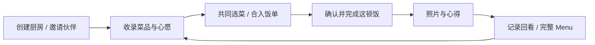

# 私人厨房 · Private Kitchen

**一个给朋友、情侣共同使用的微信小程序，把菜谱、想吃的菜和每一顿饭收进同一个私人空间。**

从“今天想吃什么”开始，两个人一起挑菜、确认饭单、记录下厨和饭局，最后生成一张可以回看、分享的 Menu。

[](https://github.com/ask6688/private-kitchen-wechat/actions/workflows/checks.yml)
微信原生小程序 · CloudBase · 双人共享 · Canvas Menu

| 菜单：挑今天想吃的菜 | 心愿：收下次想试的味道 | 记录：回看做过和吃过的饭 |
| --- | --- | --- |
|  |  |  |

> 展示图使用虚构厨房、成员和菜品，并用原创插画替代私人照片。页面图由当前 WXML/WXSS 本地渲染，完整 Menu 使用项目实际 Canvas 绘制代码；这些是演示图。真实微信运行与待验证项见 [验证说明](docs/ACCEPTANCE.md)。

## 核心场景与功能

- **一起维护厨房**：限时邀请、双人共享、厨房改名、负责人移交和成员管理
- **一起决定吃什么**：菜单分类、搜索、连续选菜；心愿可加入同一份饭单
- **安排这一顿**：日期、人数、备注，确认、完成、取消及明确重开历史饭单
- **留下下厨经验**：记录已有菜或第一次做的新菜，可选择是否收进长期菜单
- **记住一起吃饭**：补单菜照片和心得、整餐相册，从各入口进入同一 Menu 详情
- **回看与整理**：最近记录、分类列表、单条/批量删除、归档及 JSON 导出

| 饭单：把选择落成安排 | 一起吃饭：照片与每道菜的心得 | 我们：同一个双人空间 |
| --- | --- | --- |
|  |  |  |

## 一个完整的使用闭环



也可以直接记一次下厨或补录一顿已吃过的饭。长期菜品、制作记录和饭局记忆各自保留，不要求先建饭单才能记录。

<p align="center"></p>

## 产品与实现亮点

| 关注点 | 如何处理 |
| --- | --- |
| 双人共同编辑 | 云端核验成员；版本检查处理冲突，失败时保留输入 |
| 重复点击与断网重试 | 请求 ID 和回执去重，避免重复饭单、重复记录和虚增次数 |
| 历史能被认真回看 | 保存菜名、分类快照；菜品改名或归档后保留当时内容 |
| 照片上传与引用 | 压缩后走授权二进制上传，业务只保存 fileId；仍被引用的照片不可回收 |
| 页面响应 | 本地选择即时反馈，复用已有导航和加载状态，保护返回关系与编辑草稿 |
| Menu 的视觉与导出 | 同一测量结果控制图文排版；本地字形轮廓保持字体效果，处理长内容和分类间距 |

## 技术与项目结构

前端使用原生 JavaScript、WXML、WXSS 和 Canvas 2D；后端使用一个 `kitchen` 云函数、CloudBase 文档数据库及私有云存储。核心业务没有额外前端框架。

```text
miniprogram/                 小程序主体、公共工具、图标与授权字形
  pages/                    菜单、心愿、饭单、记录与双人空间
  utils/                    请求、选菜、导航、照片、侧滑
cloudfunctions/kitchen/     成员权限、事务、历史快照及照片保护
tests/                     前端行为和页面完整性检查
scripts/                    测试入口、字形构建、展示图生成
docs/                      产品、架构、验证说明和公开演示素材
.github/workflows/          自动检查
```

[产品逻辑](docs/PRODUCT.md) · [架构与数据关系](docs/ARCHITECTURE.md) · [后端部署](cloudfunctions/kitchen/README.md) · [公开文件清单](docs/PUBLIC_FILES.md)

## 本地运行

需要 Node.js 18+、微信开发者工具、自己的小程序 AppID 和 CloudBase 环境。仓库不提供线上厨房账号或私有环境配置。

1. 复制配置示例：

   ```bash
   cp project.config.example.json project.config.json
   cp miniprogram/config.example.js miniprogram/config.js
   ```

2. 在 `project.config.json` 填自己的 AppID，在 `miniprogram/config.js` 填自己的环境 ID。两个实际配置文件均被 Git 忽略。
3. 在微信开发者工具导入仓库根目录，按 [云函数说明](cloudfunctions/kitchen/README.md) 建集合、索引、私有安全规则和请求合法域名。
4. 在 `cloudfunctions/kitchen` 运行 `npm ci`，部署 `kitchen`，选择云端安装依赖，然后编译小程序。
5. 用自己的开发/体验账号创建测试厨房并邀请伙伴，走一遍选菜、记录和 Menu 流程。

运行全部本地检查：

```bash
npm test
```

这些检查使用隔离的模拟微信 API 和内存云 SDK，无需真实环境，也不写入厨房数据。真机、双账号、弱网和备份恢复另见 [验证清单](docs/ACCEPTANCE.md)。

展示素材的来源与复现方法见 [素材说明](docs/assets/README.md)。字体的来源与 SIL OFL 授权见 [字形说明](miniprogram/fonts/README.md)。
