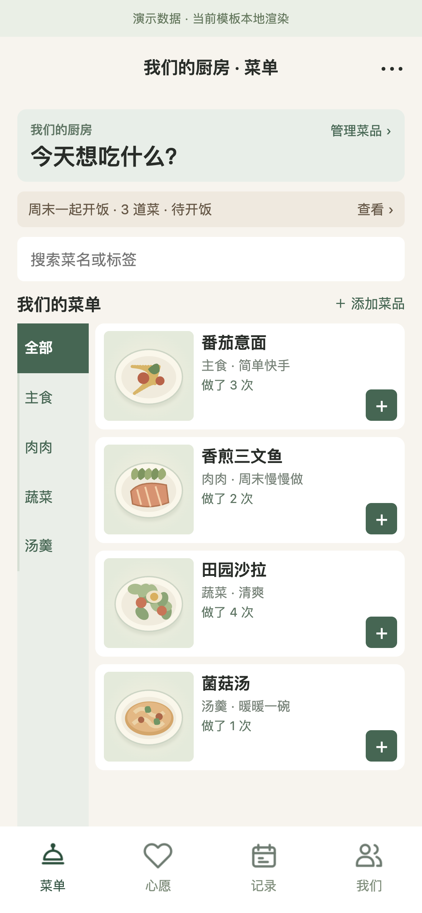
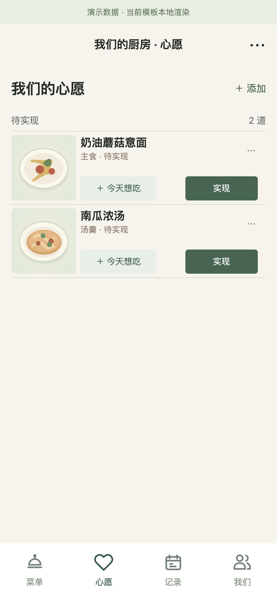
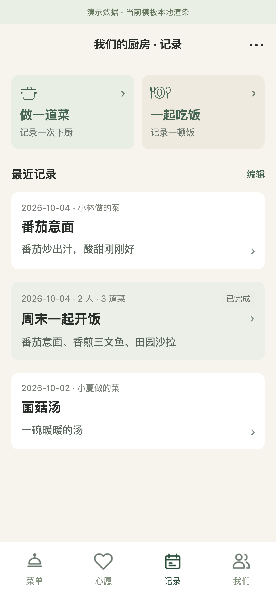
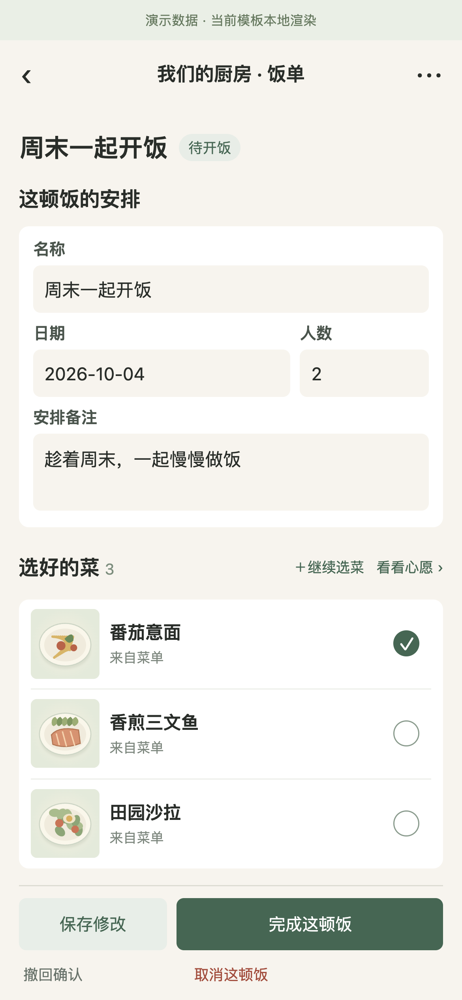
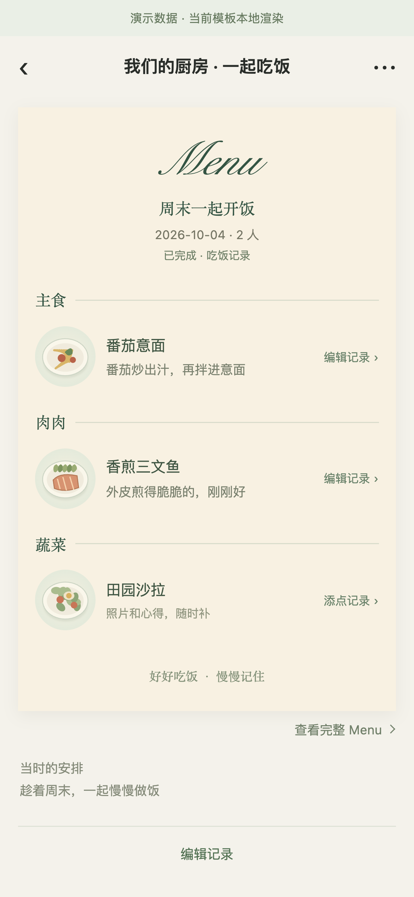
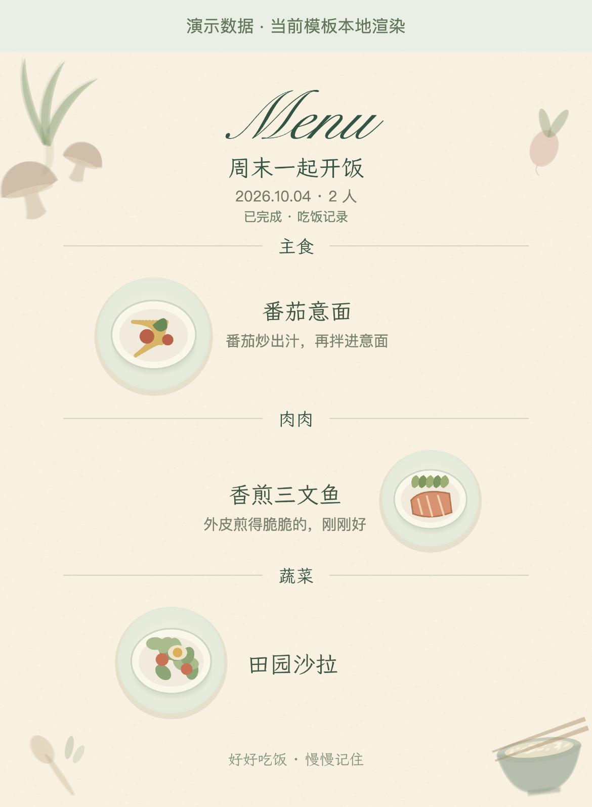
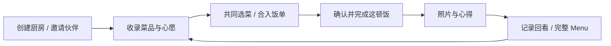
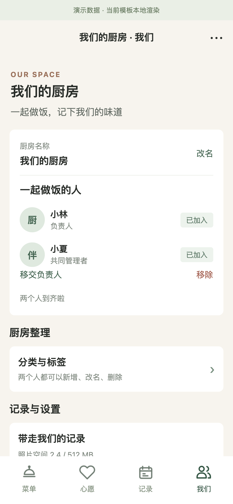

# 私人厨房 · Private Kitchen

**一个给朋友、情侣共同使用的微信小程序，把菜谱、想吃的菜和每一顿饭收进同一个私人空间。**

从“今天想吃什么”开始，两个人一起挑菜、确认饭单、记录下厨和饭局，最后生成一张可以回看、分享的 Menu。

**[打开交互 Demo →](https://ask6688.github.io/private-kitchen-wechat/)** · 无需登录，可以试试分类、搜索和选菜，再查看饭单与记录

[](https://github.com/ask6688/private-kitchen-wechat/actions/workflows/checks.yml)
微信原生小程序 · CloudBase · 双人共享 · Canvas Menu

| 菜单：挑今天想吃的菜 | 心愿：收下次想试的味道 | 记录：回看做过和吃过的饭 |
| --- | --- | --- |
| <a href="docs/assets/screenshots/menu.png"></a> | <a href="docs/assets/screenshots/wishes.png"></a> | <a href="docs/assets/screenshots/records.png"></a> |

> 展示图与 Demo 使用虚构数据和原创食物插画，复用当前页面模板；Menu 使用项目实际 Canvas 代码。Demo 的选择只保存在浏览器内存，不连接 CloudBase。微信运行与待验证项见 [验证说明](docs/ACCEPTANCE.md)。

## 难点与解决办法

| 遇到的问题 | 处理方式与取舍 |
| --- | --- |
| 图片压缩了，云函数请求仍超限 | 排查实际请求后，将 Base64 传图改为授权二进制上传；业务只存 fileId，[压缩与上传](miniprogram/utils/upload.js) 共用一条链路 |
| 两人同时编辑，后保存覆盖先保存 | 云端成员校验与事务内版本检查；冲突时拒绝覆盖，客户端保留输入，[版本检查](cloudfunctions/kitchen/index.js#L191) |
| 重复点击、响应丢失，可能重复记一顿饭 | 请求 ID、内容摘要和回执去重；重试复用原结果，同一 ID 的不同内容会被拒绝，[幂等处理](cloudfunctions/kitchen/index.js#L1028) |
| Menu 分类丢失，改名可能影响历史 | 饭单保存名称和分类快照；旧字段缺失时只补展示映射，优先尊重当时数据，[历史快照](cloudfunctions/kitchen/index.js#L622) |
| 保存或返回闪过无关页面，输入容易丢 | 复用 [导航工具](miniprogram/utils/navigation.js)，按 [实际页面栈](miniprogram/pages/menu-preview/index.js#L171) 返回；等待时显示目标页加载态，失败保留草稿 |
| 真机字体未生效，图文间距出现重叠 | Menu 改用本地 [字形轮廓](miniprogram/pages/menu-preview/font.js)；测量和绘制共用 [排版结果](miniprogram/pages/menu-preview/render.js)，减少设备字体差异 |

### 设计思考

- **长期菜谱、这次饭单、历史记忆分开保存**：支持计划开饭，也支持随手补记；修改菜谱不会覆盖过去的一顿饭
- **把“快”和“写入成功”分开处理**：分类、选菜先即时反馈；云端保存通过校验后才提示成功，网络失败时保留用户输入

回归检查覆盖上传、导航、历史记录、并发冲突和重复请求。当前真机、双账号及弱网验证范围见 [验证清单](docs/ACCEPTANCE.md)

## 从饭单到回忆

同一份饭单接住两个人的选择，完成后留下单菜与整餐的照片、心得，再生成一张完整 Menu

| 饭单：把选择落成安排 | 一起吃饭：留下照片与心得 | 完整 Menu：把这一顿收进回忆 |
| --- | --- | --- |
| <a href="docs/assets/screenshots/meal.png"></a> | <a href="docs/assets/screenshots/meal-detail.png"></a> | <a href="docs/assets/screenshots/complete-menu.png"></a> |

## 一个完整的使用闭环



| 步骤 | 用户能做什么 |
| --- | --- |
| 维护菜单 | 按分类或标签找菜，查看照片、做法和历次下厨；收录常做的菜 |
| 共同选菜 | 菜单连续选菜，心愿也能加入；先在本机挑好，再合入同一份饭单 |
| 安排开饭 | 填日期、人数与备注，确认这顿饭；未完成时可以继续调整 |
| 留下记录 | 完成后补单菜或整餐照片、心得；也可以直接记一次下厨或补录饭局 |
| 回看这一顿 | 最近记录直达对应详情，饭局生成完整 Menu；从菜谱详情回看历次下厨心得 |

<details>
<summary>双人空间：邀请与共同维护</summary>

厨房里有两位成员，双方共同维护内容；负责人负责邀请、移交与成员管理



</details>

## 技术与项目结构

前端使用原生 JavaScript、WXML、WXSS 和 Canvas 2D；后端使用一个 `kitchen` 云函数、CloudBase 文档数据库及私有云存储。核心业务没有额外前端框架。

```text
miniprogram/                 小程序主体、公共工具、图标与授权字形
  pages/                    菜单、心愿、饭单、记录与双人空间
  utils/                    请求、选菜、导航、照片、侧滑
cloudfunctions/kitchen/     成员权限、事务、历史快照及照片保护
tests/                     前端行为和页面完整性检查
scripts/                    测试入口、字形构建、展示图生成
docs/                      产品、架构、验证说明和公开演示素材
.github/workflows/          自动检查
```

[产品逻辑](docs/PRODUCT.md) · [架构与数据关系](docs/ARCHITECTURE.md) · [后端部署](cloudfunctions/kitchen/README.md) · [公开文件清单](docs/PUBLIC_FILES.md)

## 复制代码后，怎样使用

你会得到完整的小程序前端、云函数、测试和演示素材。配置自己的微信云环境后，可以创建自己的双人厨房；仓库不包含我的厨房数据、账号或环境凭据

| 想做什么 | 从这里开始 |
| --- | --- |
| 先体验页面和选菜 | [在线 Demo](https://ask6688.github.io/private-kitchen-wechat/)；无需账号，保存、上传和双人同步不在浏览器演示范围内 |
| 阅读实现、跑检查 | Clone 仓库，在根目录运行 `npm test`；只需 Node.js 18+，无需填写私人配置或安装依赖 |
| 运行完整微信小程序 | 按下面步骤配置自己的 AppID、CloudBase、数据库与存储，部署后用微信账号创建厨房 |

只想先看代码和跑检查：

```bash
git clone https://github.com/ask6688/private-kitchen-wechat.git
cd private-kitchen-wechat
npm test
```

### 运行微信小程序

需要 Node.js 18+、微信开发者工具、自己的小程序 AppID 和 CloudBase 环境

1. 复制配置示例：

   ```bash
   cp project.config.example.json project.config.json
   cp miniprogram/config.example.js miniprogram/config.js
   ```

2. 在 `project.config.json` 填自己的 AppID，在 `miniprogram/config.js` 填自己的环境 ID。两个实际配置文件均被 Git 忽略。
3. 在微信开发者工具导入仓库根目录，按 [云函数说明](cloudfunctions/kitchen/README.md) 建集合、索引、私有安全规则和请求合法域名。
4. 在 `cloudfunctions/kitchen` 运行 `npm ci`，部署 `kitchen`，选择云端安装依赖，然后编译小程序。
5. 用自己的开发/体验账号创建测试厨房并邀请伙伴，走一遍选菜、记录和 Menu 流程。

`npm test` 使用模拟微信 API 和内存云 SDK，不写入真实数据。部署后的双账号、弱网和备份恢复按 [验证清单](docs/ACCEPTANCE.md) 检查

展示素材的来源与复现方法见 [素材说明](docs/assets/README.md)。字体的来源与 SIL OFL 授权见 [字形说明](miniprogram/fonts/README.md)。
