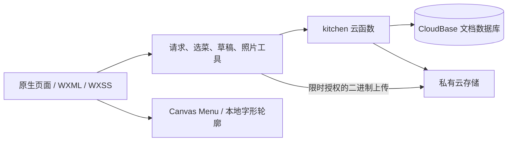

# 实现与数据关系

项目采用微信原生小程序与一个 CloudBase 云函数。前端按产品场景组织页面，共享请求、选菜、导航、照片和侧滑能力；服务端统一验证成员身份后读写共享数据。

## 核心对象

| 对象 | 保存什么 | 关键约束 |
| --- | --- | --- |
| `spaces` / `space_members` | 厨房、分类标签、成员与角色 | 每个厨房最多两人，负责人负责邀请及成员管理 |
| `recipes` | 长期菜品资料、封面、做法、分类 | 归档不破坏历史引用；制作次数由实际记录维护 |
| `wishes` | 想吃或想做的菜 | 可关联同一菜品，实现后加入菜单，不复制照片 |
| `meals` | 一顿饭的安排、状态、条目、相册与心得 | 同一厨房仅一份当前饭单；历史保留菜名和分类快照 |
| `cooking_records` | 一次下厨的照片、心得与菜品快照 | 可关联已有菜，也可只留下新菜记录 |
| `media_assets` | 云文件归属、用量及上传回执 | 按厨房验证访问；仍被引用的照片不可回收 |
| `invitations` / `users` | 限时邀请与微信身份映射 | OPENID 来自云端上下文，不由前端指定 |
| `activity_logs` | 历史兼容数据与选菜幂等回执 | 保留历史和重试依据，当前 UI 不展示动态流 |

## 可靠性设计

- **身份与权限**：数据库及存储禁止客户端直接读写；云函数核验调用来源、成员身份和资源所属厨房。上传仅获得指定暂存对象的限时授权。
- **并发与重试**：共享编辑使用版本检查；饭单提交、制作记录及上传用请求回执处理重复点击和丢失响应。冲突时保留输入，明确提示核对后重试。
- **数据生命周期**：长期菜品、单菜记录、整顿饭相册各自管理引用；删除记录同步相关计数和列表，文件只在无引用时回收。
- **照片链路**：选图后统一压缩并检查成品体积。授权请求、二进制上传和最终确认分开，业务数据保存 fileId，避免把整张图片放进云函数请求。
- **Menu**：历史分类快照优先，缺失时兼容已有来源信息。完整图用一次测量结果排版；照片阴影和下一分类之间保留净空。随包字形直接绘制，避免不同设备字体注册结果不一致。
- **页面复用**：`menu-picker`、`wish-picker` 和 `record-list` 保留各自的原生页面栈，分别复用 `menu/page.js`、`wishes/page.js`、`records/page.js`，不是两套业务实现。

## 代码入口

- `miniprogram/pages/meal/`：当前饭单、补录吃饭、整餐相册和心得
- `miniprogram/pages/record-edit/`：一次下厨与单菜记录
- `miniprogram/pages/menu-preview/`：一起吃饭详情、完成反馈、完整 Menu 排版
- `miniprogram/utils/`：请求边界、选菜、照片上传读取、导航及侧滑
- `cloudfunctions/kitchen/index.js`：动作路由、权限与事务逻辑
- `tests/`：隔离运行的前端行为检查；云函数测试在其目录内

详细集合索引、部署与旧客户端兼容接口见 [云函数说明](../cloudfunctions/kitchen/README.md)。
